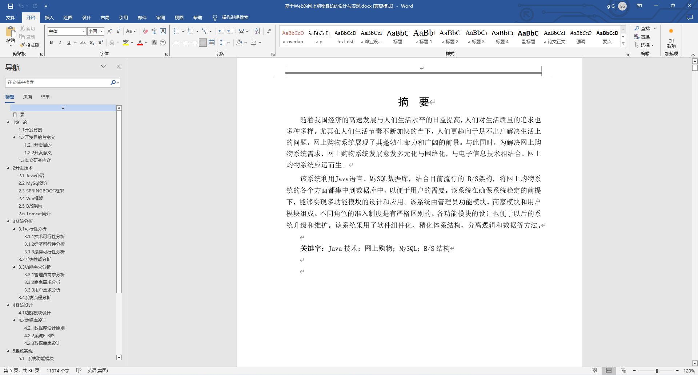
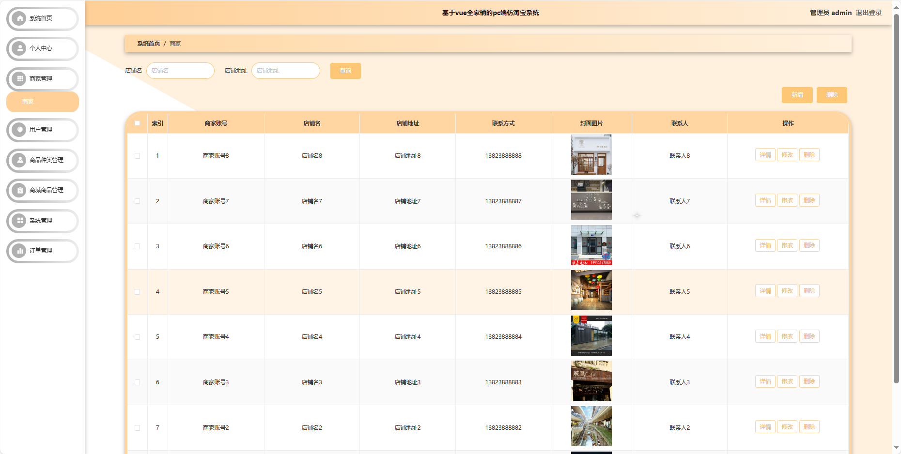
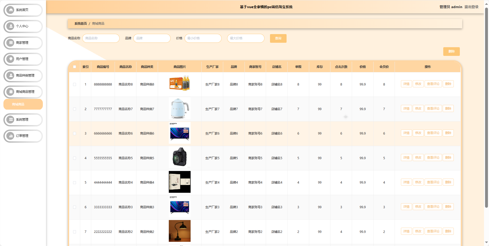
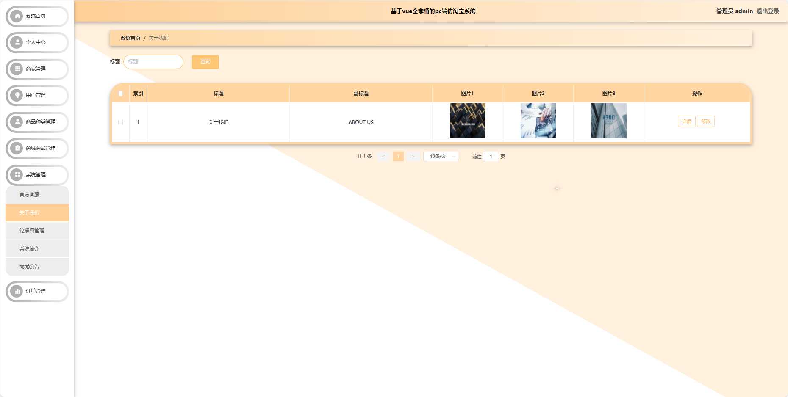
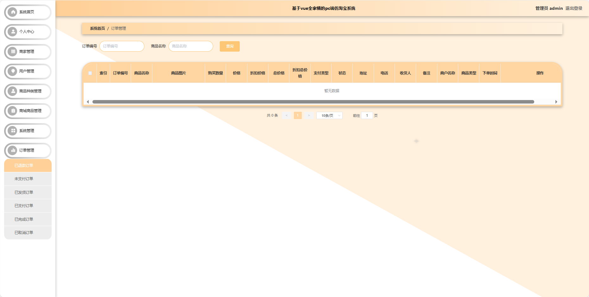

## 基于SpringBoot的pc端仿淘宝系统(程序+报告)

###  获取sql数据库文件: 从戎源码网 (https://armycodes.com/) QQ: 386869957 QQ群: 377586148
###  所有系统地址: (https://github.com/YuLin-Coder/AllProjectCatalog) 
###  所有项目以及源代码本人均调试运行无问题 可支持远程安装部署调试、定制修改、代码讲解

## 项目介绍
基于SpringBoot的pc端仿淘宝系统，系统包含三种角色：管理员、用户,商家主要功能如下。

### 【管理员】:
系统首页：查看系统整体概况。
个人中心：管理个人信息。
商家管理：审核和管理注册商家的基本信息。
用户管理：管理系统注册用户的信息。
商品种类管理：管理商城中的商品分类信息。
商城商品管理：监管和管理商城中的商品信息。
系统管理：管理系统的基本设置和运行参数。
订单管理：查看和处理用户的购物订单。

### 【商家】:
系统首页：查看商家相关的概况。
个人中心：管理个人商家信息。
商家管理：编辑和管理商家基本信息。
商城商品管理：管理商家发布的商品信息。
订单管理：查看和处理用户购买商家商品的订单。

### 【用户】:
首页：浏览系统的主要信息。
商城商品：查看商城中的各类商品，包括商品详情和价格。
商城公告：阅读系统发布的相关公告和通知。
官方客服：与系统提供的官方客服进行在线沟通。
购物车：管理已选购商品，包括添加、删除和结算功能。
个人中心：管理个人信息、查看订单记录等。

## 项目技术
- 编程语言：Java
- 数据库：MySQL
- 项目管理工具：Maven
- 前端技术：HTML、CSS、JavaScript、Jquery、Vue
- 后端技术：Spring、SpringMVC、MyBatis

## 运行环境
- JDK版本：JDK1.8及以上
- 开发工具：IDEA、Ecplise、Myecplise都可以
- 数据库: MySQL5.7及以上
- Maven：maven3.0及以上
- Node：14.14.0及以上

## 运行截图

